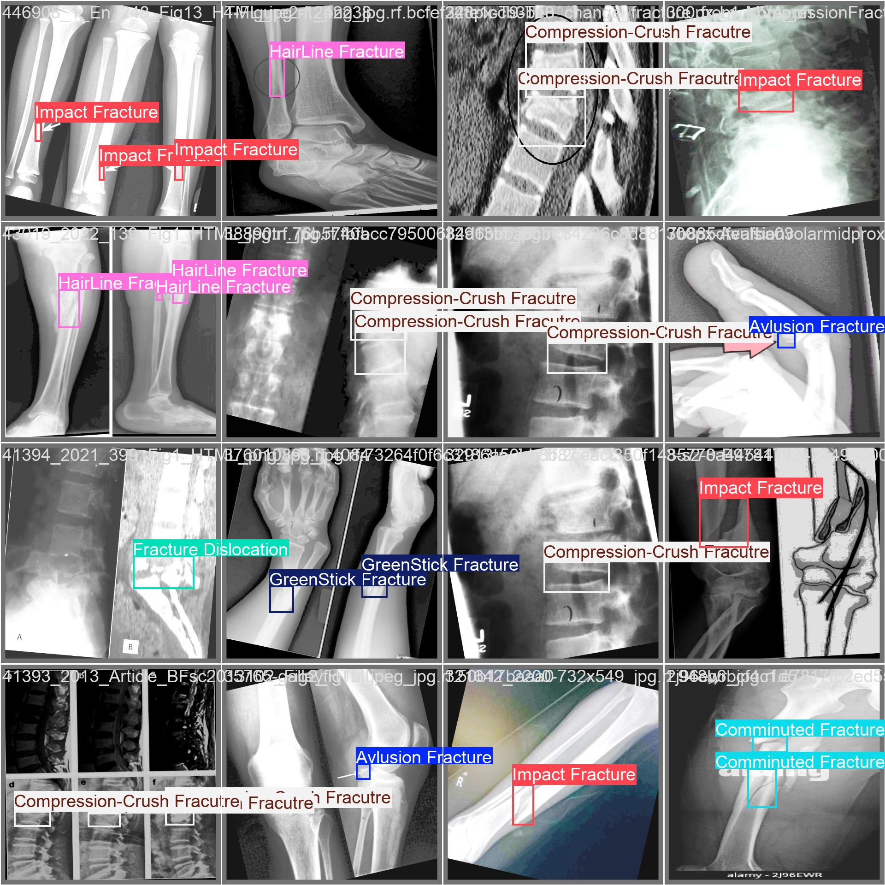
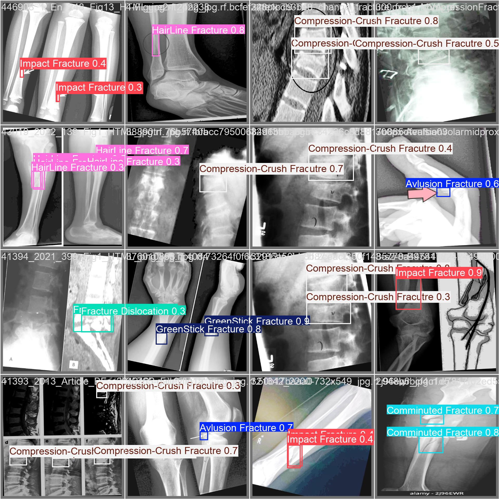
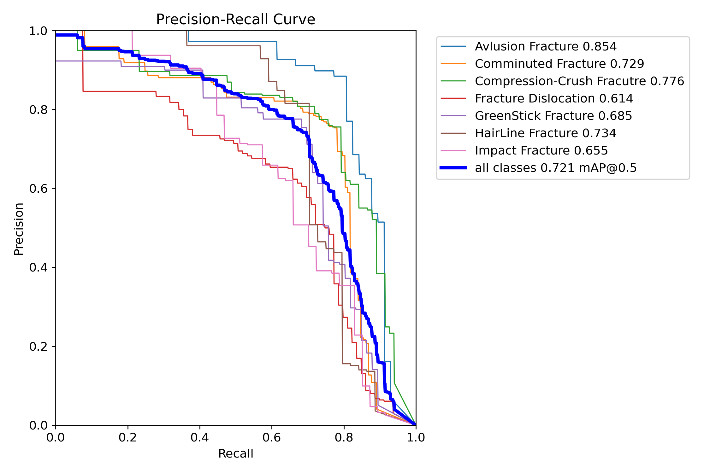
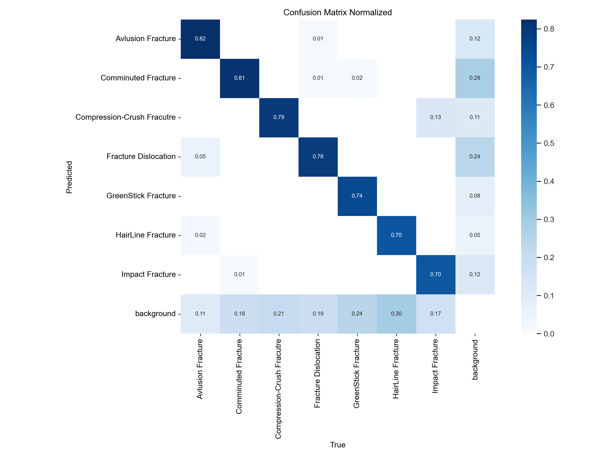

# Bone Fracture Detection using YOLOv8

## Project Overview

This project aims to develop an automated system for accurately detecting bone fractures in X-ray images using Computer Vision. The primary objective is to provide a rapid and accurate diagnostic aid, particularly beneficial in medical emergencies and resource-limited environments. By automating fracture detection, the system can help minimize delayed or missed diagnoses and assist in prioritizing urgent cases.

## Why This Project?

* **Accurate and Rapid Diagnosis:** In emergency medical contexts, timely and precise diagnoses are crucial. This project addresses this need by providing an automated solution.
* **Resource-Limited Settings:** The automation of X-ray interpretation can significantly assist healthcare professionals in areas where resources or specialized personnel may be scarce.
* **Workload Reduction & Error Prevention:** Automating the initial detection process can reduce the workload on medical staff and help prevent human errors, thereby improving patient care.

## Dataset and Preprocessing

The dataset used for this project consists of X-ray images, sourced from Roboflow Universe. Each image is accompanied by a label file that specifies the location and type of fracture using bounding boxes.
Source: https://universe.roboflow.com/ahmedali-aqmwq/break-bone 

### Fracture Classes Included:
Initially, the dataset contained 11 classes, which were refined to 7 to improve model efficiency and robustness. The primary fracture types focused on are:
* Alvusion Fracture
* Comminuted Fracture
* Compression-Crush Fracture
* Fracture Dislocation
* GreenStick Fracture
* HairLine Fracture
* Impact Fracture

### Preprocessing Steps:
* **Label Verification:** Ensured high-quality annotations by removing noisy data to prevent the model performance from dropping. This means keeping only high-quality, meaningful annotations.
* **Class Cleaning:** Small classes and outliers with significantly less data were removed to prevent label noise and make the model more efficient in detecting the classes. This included removing `null`, `oblique`, `spiral`, and `Intra-articular splits` classes.
* **Dataset Structure:** The processed dataset is organized into three sets: `train`, `valid`, and `test`.
    * `train`: Used for model learning.
    * `valid`: Used for tuning and monitoring during training.
    * `test`: Used for final evaluation of the model's performance on unseen data.

## Model and Training

### Model Architecture
The project utilizes **YOLOv8n (You Only Look Once v8 nano)**, an object detection architecture from Ultralytics. YOLO models are known for their speed and accuracy in real-time object detection.

### Training Process
The training process involves the following steps:
1.  **Input Image:** An X-ray image is fed into the YOLOv8 model.
2.  **Forward Pass:** The neural network processes the image and generates predictions, including bounding boxes and class labels.
3.  **Loss Calculation:** These predictions are compared against the ground truth, and a loss function calculates the discrepancy. This `Loss` value is used to adjust model parameters.
4.  **Backpropagation:** The model uses the `Loss` value to adjust its parameters (weights) during training, which improves its performance.

### Training Configuration:
The model was trained with the following parameters:
* **Model:** `yolov8n.pt` (a pre-trained YOLOv8 nano model)
* **Dataset Path:** `./Break-bone-3/data.yaml`
* **Epochs:** 70 (An epoch represents a complete pass through the entire training dataset, allowing the model to learn and improve performance).
* **Image Size (`imgsz`):** 640
* **Device:** `cpu` (for training on CPU)
* **Batch Size:** 8 (A batch is a subset of the training data processed together in one forward and backward pass, leading to weight updates after a group of examples. A small batch means more updates, less memory, and possibly better generalization).

### Inference
For inference (making predictions on new images), YOLO uses a single-pass process:
1.  The image is divided into a grid.
2.  The model directly predicts bounding boxes and class labels in one pass, making it very fast and efficient.

## Results

After 70 epochs of training, the model achieved promising results:

* **Overall Mean Average Precision (mAP@0.5):** 0.721 (72.1%)
* **Excellent Performance for Avulsion Fractures:** Achieved an mAP@0.5 of 0.854 (85.4%).

| Class                   | mAP@0.5 | mAP@0.5:0.95 | Notes             |
| :---------------------- | :------ | :----------- | :---------------- |
| Avulsion Fracture       | 0.854   | 0.333        | Excellent detection |
| Comminuted Fracture     | 0.729   | 0.277        | Solid performance |
| Compression-Crush Frac. | 0.776   | 0.398        | Highest score |
| GreenStick Fracture     | 0.685   | 0.244        | Stable, decent |
| HairLine Fracture       | 0.734   | 0.260        | Good |
| Impact Fracture         | 0.655   | 0.267        | Decent |
| Fracture Dislocation    | 0.614   | 0.211        | Could improve |

* **mAP@0.5:0.95:** It is important to note that the mAP@0.5:0.95 score is lower, as it requires more precise localization (higher localization threshold).

### Visual Results:
The repository includes visual comparisons of labeled ground truth versus model predictions, demonstrating the model's ability to efficiently detect fractures in most cases.

*Image of Labeled images and Model's predictions*

### Precision-Recall Curve:
The precision-recall curve provides insights into the model's performance for each class. Classes with curves closer to the upper-right corner indicate strong performance (high precision and recall).

*Precision-Recall Curve showing performance for different fracture classes.*

### Normalized Confusion Matrix:
The confusion matrix highlights which classes are most accurately predicted and where confusions occur:
* **Most Accurately Predicted:** Avulsion (82%), Comminuted (81%), Compression-Crush (79%).
* **Frequent Confusions:** Some fractures classified as background (up to 28%); HairLine and Fracture Dislocation also show some confusion.

*Normalized Confusion Matrix illustrating classification accuracy and common confusions.*

## Demo

A Streamlit-based application has been developed to demonstrate the automatic detection in action. Users can upload an X-ray image, and the application will process it through the trained model to display fracture predictions.

## Conclusion

This project successfully demonstrates the application of Computer Vision for bone fracture detection, utilizing the YOLOv8 model. We achieved a promising mean Average Precision (mAP) of 0.721 for all classes after 70 epochs of training, with notable excellent performance for Avulsion Fractures (0.854 mAP). While there is always room for further improvement, particularly for certain fracture types and in achieving higher mAP@0.5:0.95 scores, the overall results underscore the significant potential of this automated diagnostic tool. This technology can contribute to more accurate and rapid diagnostics in critical medical situations, reducing workload and preventing potential errors. Further training and optimization efforts could lead to even higher accuracy and robustness.

## Setup and Usage

### Prerequisites
* Python 3.x
* PyTorch
* Ultralytics (for YOLOv8)
* OpenCV
* Streamlit (for the demo app)